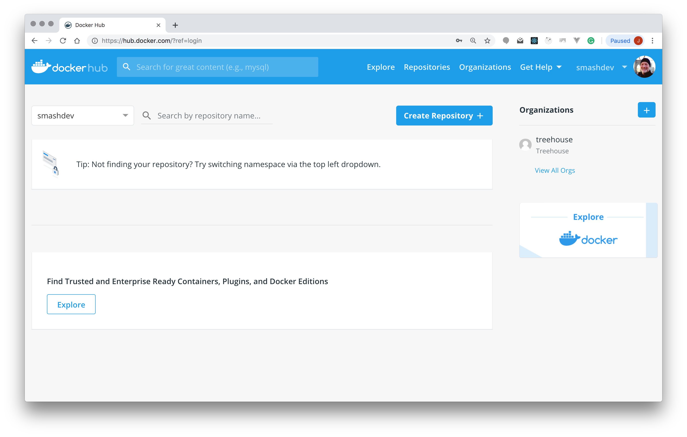
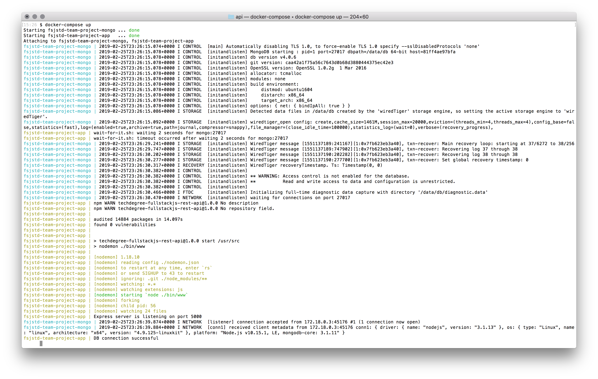

# FSJS Team Project for TalentPath

## Getting Started

This repo contains two projects: an [Express REST API project](/api) (based upon FSJS Techdegree unit 9 project) and a [React client project](/client) (based upon FSJS Techdegree unit 10 project).

For an overview of the layout of each project, see the following README files:

* [Express REST API Project](/api/README.md)
* [React Client Project](/client/README.md)

## [Express REST API Project](/api)

Before attempting to use the React client, you need to get the Express REST API application up and running.

### Project Overview

The Express REST API project makes use of Docker containers in order to ease the process of setting up a consistent, predictable development environment. By using Docker containers, you can set up a local development environment on your system without having to install MongoDB or a specific version of Node.js.

While it's not an absolute necessity, having a basic familiarity with Docker will be helpful while working on this project. For an introduction to Docker, check out Treehouse's [Introduction to Docker](https://teamtreehouse.com/library/introduction-to-docker) course.

**If you are working on a Windows operating system: Docker setup can be more complicated in Windows, feel free to move forward to the [Developing Without Docker](#developing-without-docker) section.**

### Verifying Your Docker Installation

Start with checking that you have Docker installed on your system by running the following command in a terminal (or command prompt) window:

```
docker -v
```

If you have Docker installed, you'll see its version and build number:

```
Docker version 18.09.2, build 6247962
```

If the `docker` command isn't recognized, then it's likely that you need to install Docker. For guidance on how to do that, check out the following links:

* [Install Docker Desktop for Mac](https://docs.docker.com/docker-for-mac/install/)
* [Install Docker Desktop for Windows](https://docs.docker.com/docker-for-windows/install/)

### Docker Hub

If you haven't already, visit [Docker Hub](https://hub.docker.com/) and create yourself an account. After installing Docker on your system, you'll need to sign-in using your Docker ID. If you sign-in using your email address (instead of your Docker ID), you'll receive an error when attempting to download Docker images from Docker Hub using the [Docker CLI](https://docs.docker.com/engine/reference/commandline/cli/).

Your Docker ID displays in the upper right hand corner of the Docker Hub website. You can see my Docker ID, "smashdev", displayed just to the left of my profile photo:



### Running Docker Linux Containers on Windows

While Docker for Windows supports both Linux and Windows containers, the REST API application expects to be running within a Linux container. Because of this, if you're using Windows 10 you need to ensure that Docker for Windows is configured to use Linux containers.

You can run the following command to test your if Docker for Windows is configured to use Linux containers:

```
docker run --rm busybox echo hello_world
```

The Docker `run` command will pull down the embedded Linux [`busybox` image](https://hub.docker.com/_/busybox) (if it hasn't already been pulled), create a container from that image, start the container, execute the `echo` command with the argument `hello_world`, and remove the container:

```
Unable to find image 'busybox:latest' locally
latest: Pulling from library/busybox
697743189b6d: Pull complete
Digest: sha256:061ca9704a714ee3e8b80523ec720c64f6209ad3f97c0ff7cb9ec7d19f15149f
Status: Downloaded newer image for busybox:latest
hello_world
```

If this command doesn't work, then ensure that:

* You're using the latest version of Docker for Windows (as of this writing Docker Desktop version 2.0.0.3 and Docker Engine 18.09.2).
* Docker for Windows is configured to use Linux containers by right clicking on the Docker Desktop icon in the Windows system tray and select "Switch to Linux containers...".

### Creating and Starting the Docker Containers

The Express REST API project uses two Docker containers:

* A container for the Mongo database
* A container for the Node.js and Express REST API application

[Docker Compose](https://docs.docker.com/compose/) automates the configuration of these containers. To create and start the containers, open a terminal (or command prompt) window, browse to the `api` folder, and run the following command:

```
docker-compose up
```

The first time that you run this command, Docker Compose will download the necessary base images (if they haven't already been downloaded):

```
Pulling mongo (mongo:)...
latest: Pulling from library/mongo
7b722c1070cd: Pull complete
5fbf74db61f1: Pull complete
ed41cb72e5c9: Pull complete
7ea47a67709e: Pull complete
778aebe6fb26: Pull complete
3b4b1e0b80ed: Pull complete
844ccc42fe76: Pull complete
eab01fe8ebf8: Pull complete
e5758d5381b1: Pull complete
dc553720c5c3: Pull complete
67750c781aa2: Pull complete
b00b8942c827: Pull complete
32201bb8ca69: Pull complete
Building app
Step 1/4 : FROM node:10.15.1
10.15.1: Pulling from library/node
741437d97401: Pull complete
34d8874714d7: Pull complete
0a108aa26679: Pull complete
7f0334c36886: Pull complete
65c95cb8b3be: Pull complete
a36b708560f8: Pull complete
4090f912e6c7: Pull complete
ce5fe2607c2e: Pull complete
Digest: sha256:91d4f8b1d5094d413afdcae4af37e4361686019691c441c09a021864ddeb468e
Status: Downloaded newer image for node:10.15.1
 ---> 8fc2110c6978
```

Then Docker Compose will create the Docker image for the REST API application container (the Mongo database container is created from the prebuilt `mongo` image available through [Docker Hub](https://hub.docker.com/)):

```
Step 2/4 : WORKDIR /usr/src
 ---> Running in 7766142d2a1d
Removing intermediate container 7766142d2a1d
 ---> 4b4b9588eb35
Step 3/4 : EXPOSE 5000
 ---> Running in 6eb11f7494c4
Removing intermediate container 6eb11f7494c4
 ---> e1f5bca19c55
Step 4/4 : CMD ["./wait-for-it.sh", "-t", "2", "mongo:27017", "--", "./startup.sh"]
 ---> Running in 9a315f5f4765
Removing intermediate container 9a315f5f4765
 ---> 93dd8bb66502
Successfully built 93dd8bb66502
Successfully tagged api_app:latest
WARNING: Image for service app was built because it did not already exist. To rebuild this image you must use `docker-compose build` or `docker-compose up --build`.
```

*Note: Your specific output might vary.*

After the images have been created, Docker Compose will create and start the containers:

```
Creating fsjstd-team-project-mongo ... done
Creating fsjstd-team-project-app   ... done
Attaching to fsjstd-team-project-mongo, fsjstd-team-project-app
```

Next, there'll be numerous messages from the applications running within each of the containers.

To stop the containers press `CTRL+C`:

```
Gracefully stopping... (press Ctrl+C again to force)
Stopping fsjstd-team-project-app     ... done
Stopping fsjstd-team-project-mongo   ... done
```

Restarting the containers using the `docker-compose up` command (after the initial startup process) takes less time:

```
Starting fsjstd-team-project-mongo ... done
Starting fsjstd-team-project-app   ... done
Attaching to fsjstd-team-project-mongo, fsjstd-team-project-app
```

Here's an example of the complete startup process output (your specific output will vary a bit):



### Docker Container Configuration

The REST API application container depends on the Mongo database container. The Docker Compose configuration (see the [`docker-compose.yml` file](docker-compose.yml)) explicitly defines the dependency between these two containers. This ensures that the Mongo database container starts before the REST API application container.

Unfortunately, while Docker Compose allows us to specify the container startup order, Docker only oversees the startup of the containers, not the startup of any applications or services running within that containers (see [this page](https://docs.docker.com/compose/startup-order/) in the Docker documentation for more information about this issue).

To ensure that the Mongo database is "ready" before we attempt to start the REST API application, we need to rely upon something other than Docker. The [wait-for-it](https://github.com/vishnubob/wait-for-it) open source shell script monitors the Mongo database container waiting for the database to be "ready". Once the database is ready, wait-for-it starts the REST API application.

### Docker Cleanup

Under normal circumstances, you should be able to create your Docker images and containers and ignore them. If you ever run into issues, you can run one of the following commands from the `api` folder to stop and delete the REST API application and Mongo database containers and the associated REST API application image.

For macOS:

```
./docker-cleanup.sh
```

For Windows:

```
.\docker-cleanup.bat
```

Then run the `docker-compose up` command again to recreate your containers.

**Warning: Running either of these cleanup commands will delete your application's database. All of the changes to your data since seeding the database will be lost.**

### Starting an Interactive Shell Within a Running Container

Sometimes it's helpful to start an interactive shell within a running container. To do this, start the containers using the `docker-compose up` command, then run the following command in another terminal (or command prompt) window:

```
docker exec -it fsjstd-team-project-app bash
```

To open an interactive shell within the Mongo database container, change `fsjstd-team-project-app` to `fsjstd-team-project-mongo`:

```
docker exec -it fsjstd-team-project-mongo bash
```

To exit the shell, run the `exit` command.

### Seeding the Database

To seed the database, start the containers using `docker-compose up`, then run the following command in another terminal (or command prompt) window:

```
docker exec fsjstd-team-project-app npm run seed
```

The output for the database seeding process will look like:

```
Connecting to the database...
Hashing the user passwords...
Removing all documents from the 'users' collection...
Inserting documents into the 'users' collection...
Removing all documents from the 'courses' collection...
Inserting documents into the 'courses' collection...
```

### Testing the REST API

Once you have the Express REST API project's containers up and running, you can test the REST API to ensure that everything is working as expected.

To retrieve a list of courses, make a GET request to the following endpoint using a browser or a tool like [Postman](https://www.getpostman.com/).

```
localhost:5000/api/courses
```

In the folder that contains this README file, you'll find a Postman collection, that you can use to further manually test the REST API.

You can also run the following command to execute the integration tests that are provided with the project (see the `src/app.spec.js` file):

```
docker exec fsjstd-team-project-app npm run test-once
```

*Note: The application initially contains bugs (that'll work as a team to fix), so some of the integration tests will fail.*

### Making Changes to the REST API

The `nodemon` package makes working on the Express REST API project as easy as possible. To make a change to the project, just open the `src` folder into the code editor of your choice, change a code file, and the application will restart (assuming that you have the REST API application container currently running).

*Note: Due to complications with Docker volumes when running Linux based containers on Windows, the `nodemon` package isn't able to correctly detect changes to watched files. As you workaround, you'll need to stop and restart your containers to test your latest code changes.*

### Developing Without Docker

If you're unable to install and run Docker on your system, you can fallback to using MongoDB and Node.js directly on your system.

To start, open the [`api/src/.env`](api/src/.env) file, and change the `DB_HOST` environment variable from `mongo` to `localhost`:

```
DB_HOST=localhost
```

Then, run the following commands from the [`api/src/`](api/src/) folder.


First, install the project's dependencies using `npm`.

```
npm install
```

Second, ensure that you have MongoDB installed globally on your system.

* Open a `Command Prompt` (on Windows) or `Terminal` (on Mac OS X) instance and run the command `mongod` (or `sudo mongod`) to start the MongoDB daemon.
* If that command failed then you’ll need to install MongoDB.
* [How to Install MongoDB on Windows](http://treehouse.github.io/installation-guides/windows/mongo-windows.html)
* [How to Install MongoDB on a Mac](http://treehouse.github.io/installation-guides/mac/mongo-mac.html)

Third, seed your MongoDB database with data.

```
npm run seed
```

Fourth, comfirm the state of the project by running the provided integration tests.

```
npm run test-once
```

*Note: The application initially contains bugs (that'll work as a team to fix), so some of the integration tests will fail.*

And lastly, start the application.

```
npm start
```

### Endpoints and Routes

The REST API provides two endpoints: "/api/courses" and "/api/users". 

#### Courses

The "/api/courses" endpoint supports the following routes (listed in the format `HTTP VERB` `Route` `HTTP Status Code`).

* `GET` `/api/courses` `200` - Returns a list of courses (including the user that owns each course)
* `GET` `/api/courses/:id` `200` - Returns a the course (including the user that owns the course) for the provided course ID
* `POST` `/api/courses` `201` - Creates a course, sets the `Location` header, and returns no content
* `PUT` `/api/courses/:id` `204` - Updates a course and returns no content
* `DELETE` `/api/courses/:id` `204` - Deletes a course and returns no content

#### Users

The "/api/users" endpoint supports the following routes (listed in the format `HTTP VERB` `Route` `HTTP Status Code`).

* `GET` `/api/users` `200` - Returns the currently authenticated user
* `POST` `/api/users` `201` - Creates a user, sets the `Location` header to "/", and returns no content

### Authentication

The following routes require a basic authentication `Authorization` header (see [this instruction step in the FSJS Techdegree](https://teamtreehouse.com/library/rest-api-authentication-with-express) for more information) to be set on the request.

* `POST` `/api/courses`
* `PUT` `/api/courses/:id`
* `DELETE` `/api/courses/:id`
* `GET` `/api/users`

## [React Client Project](/client)

Next, you need to get the React client up and running by completing the following steps:

* *Note: If you haven't already, follow the above instructions under the "Express REST API Project" section to create and start your REST API project's Docker containers*
* From a terminal, browse to the `client` folder
* Run the command `npm install` to install the project's dependencies
* Then, run the command `npm start` to start the React client application 

At this point, you should be able to view a list of courses and view the detail for a specific course. You can also register a new user account, which you can use to create, update, and delete courses. Or you can sign in using the "Joe Smith" test account. `joe@smith.com` is the username/email address and `joepassword` is the account's password.
